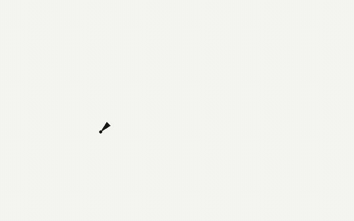
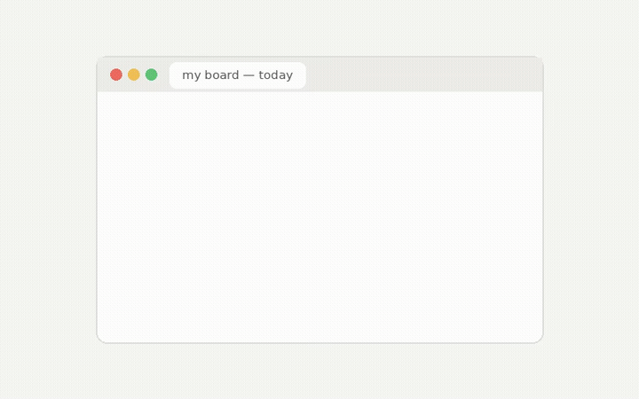
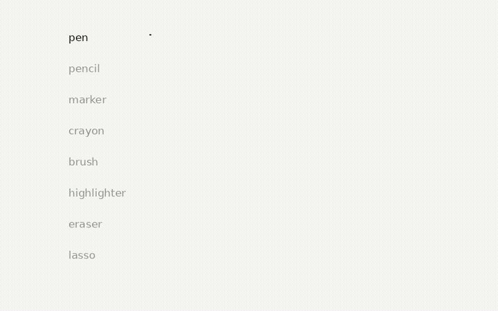
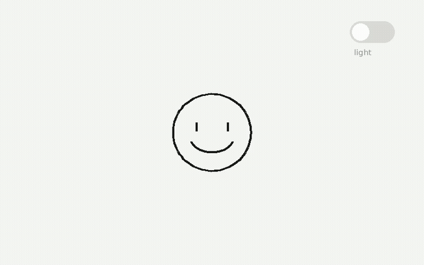
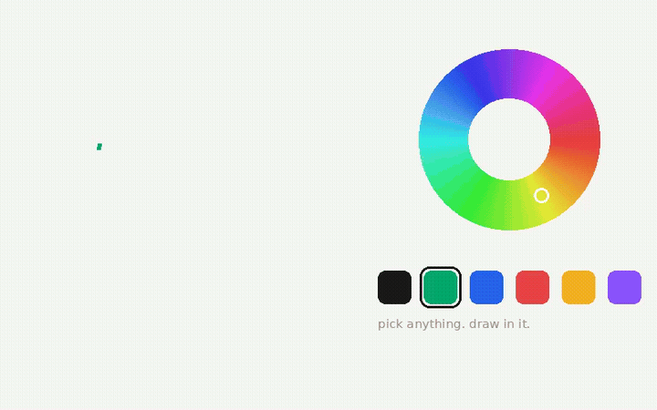
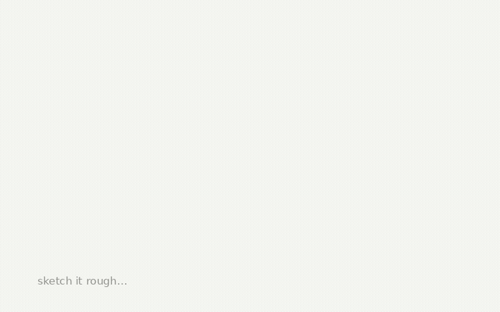
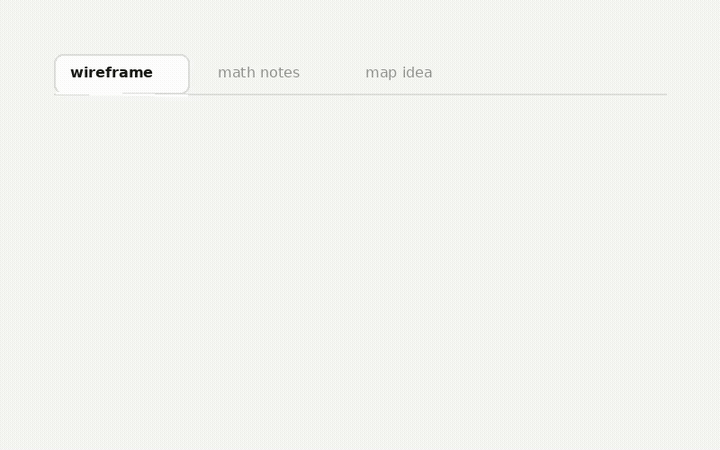

<p align="left">
  <a href="https://pencilbox.netlify.app/">
    
  </a>
</p>

A browser-based whiteboard with an infinite graph-paper canvas. No accounts, no install — draw locally, switch tabs, and pick up where you left off.

**[Try it live → pencilbox.netlify.app](https://pencilbox.netlify.app/)**

## Demos

### Zero friction
Open the board and start drawing immediately.



### Strokes don't vanish
Your work stays saved in the browser.



### Eight pen types
Pen, pencil, marker, crayon, brush, highlighter, eraser, and lasso.



### Dark mode
Green-tinted theme for late-night sketching.



### Color wheel
Swatches and a custom color picker.



### Draw & iterate
Undo, redo, and refine your ideas.



### Think in tabs
Chrome-style tabs for multiple boards at once.



> Source clips live in [`media/`](media/) as `.webm` files for the landing page. README uses `.gif` previews because GitHub does not embed repo-hosted `.webm` videos.

## Run locally

```bash
git clone https://github.com/Abhir1902/Pencil-box.git
cd Pencil-box
python3 -m http.server 8080
```

Open `http://localhost:8080` — a local server is needed because the app uses ES modules.

## Tech

HTML · CSS · vanilla JavaScript · `localStorage` · hosted on [Netlify](https://pencilbox.netlify.app/)
